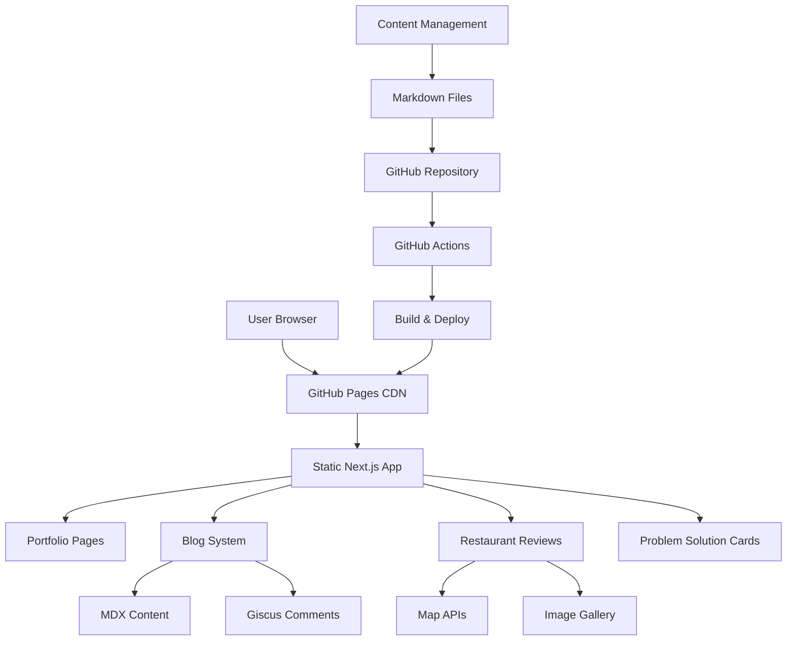
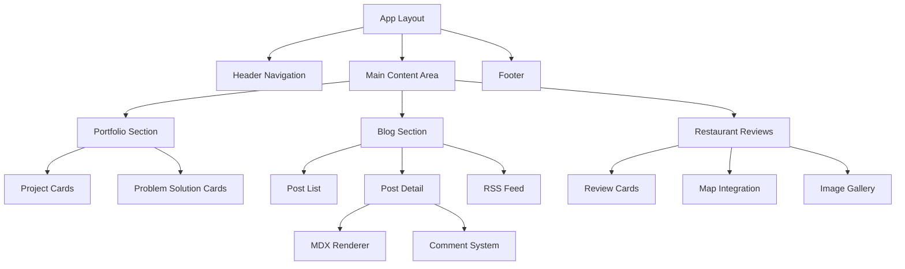

# Design Document

## Overview

개인 웹사이트는 Next.js 14 기반의 정적 사이트로 구축되며, GitHub Pages를 통해 배포됩니다. 포트폴리오, 블로그, 음식점 리뷰 기능을 통합한 개인 브랜딩 플랫폼으로, 모던하고 인터랙티브한 사용자 경험을 제공합니다.

## Architecture

### System Architecture



### Technology Stack

**Frontend Framework:**
- **Next.js 14** with App Router and Static Export
- **TypeScript** for type safety
- **React 18** with Server Components

**Styling & UI:**
- **Tailwind CSS** for utility-first styling
- **Framer Motion** for animations and interactions
- **Lucide React** for consistent iconography
- **next/image** for optimized image handling

**Content Management:**
- **MDX** for enhanced markdown with React components
- **gray-matter** for frontmatter parsing
- **remark/rehype** plugins for markdown processing
- **Prism.js** for syntax highlighting

**Comments System:**
- **Giscus** (GitHub Discussions based)
- Anonymous commenting through GitHub integration

**Maps Integration:**
- **Naver Maps API** for Korean locations
- **Kakao Map API** as fallback
- **Google Maps API** for international locations

**Build & Deployment:**
- **GitHub Actions** for CI/CD
- **GitHub Pages** for hosting
- **Sharp** for image optimization

## Components and Interfaces

### Core Components Architecture



### Component Specifications

#### 1. Layout Components

**Header Navigation (`components/layout/Header.tsx`)**
```typescript
interface HeaderProps {
  currentPath: string;
}

interface NavigationItem {
  label: string;
  href: string;
  icon?: LucideIcon;
}
```

**Footer (`components/layout/Footer.tsx`)**
```typescript
interface FooterProps {
  socialLinks: SocialLink[];
  rssUrl: string;
}
```

#### 2. Portfolio Components

**ProjectCard (`components/portfolio/ProjectCard.tsx`)**
```typescript
interface Project {
  id: string;
  title: string;
  description: string;
  period: string;
  teamSize: number;
  techStack: string[];
  githubUrl?: string;
  demoUrl?: string;
  problems: ProblemSolution[];
}
```

**ProblemSolutionCard (`components/portfolio/ProblemSolutionCard.tsx`)**
```typescript
interface ProblemSolution {
  id: string;
  title: string;
  problem: string;
  solution: string;
  technologies: string[];
  projectId: string;
  slug: string;
  // Blog integration
  blogPostSlug?: string;  // Link to detailed blog post
  isDetailedInBlog: boolean;  // Whether full content is in blog
  excerpt?: string;  // Short summary for card display
}
```

#### 3. Blog Components

**PostList (`components/blog/PostList.tsx`)**
```typescript
interface BlogPost {
  slug: string;
  title: string;
  description: string;
  date: string;
  tags: string[];
  category: string;
  readingTime: number;
  excerpt: string;
}
```

**MDXRenderer (`components/blog/MDXRenderer.tsx`)**
```typescript
interface MDXRendererProps {
  source: string;
  components?: Record<string, React.ComponentType>;
}
```

**CommentSection (`components/blog/CommentSection.tsx`)**
```typescript
interface CommentSectionProps {
  postSlug: string;
  giscusConfig: GiscusConfig;
}
```

#### 4. Content Integration Components

**BlogPortfolioIntegration (`components/integration/BlogPortfolioIntegration.tsx`)**
```typescript
interface BlogPortfolioIntegrationProps {
  blogPosts: BlogPost[];
  projects: Project[];
}

// Utility to link blog posts to portfolio problems
interface ContentLinker {
  linkBlogToProject(blogSlug: string, projectId: string): void;
  getProblemSolutionPosts(projectId: string): BlogPost[];
  getBlogPostBySlug(slug: string): BlogPost | null;
}
```

#### 5. Restaurant Review Components

**RestaurantCard (`components/reviews/RestaurantCard.tsx`)**
```typescript
interface Restaurant {
  id: string;
  name: string;
  location: {
    address: string;
    coordinates: [number, number];
  };
  rating: number;
  visitDate: string;
  cuisine: string;
  priceRange: number;
  images: string[];
  review: string;
  tags: string[];
}
```

**MapIntegration (`components/reviews/MapIntegration.tsx`)**
```typescript
interface MapIntegrationProps {
  restaurant: Restaurant;
  mapProviders: {
    naver: string;
    kakao: string;
    google: string;
  };
}
```

## Data Models

### Content Structure

```typescript
// Portfolio Data Model
interface PortfolioData {
  personalInfo: {
    name: string;
    title: string;
    email: string;
    github: string;
    summary: string;
  };
  experience: Experience[];
  projects: Project[];
  certifications: Certification[];
  education: Education[];
}

// Blog Post Model
interface BlogPostMeta {
  title: string;
  description: string;
  date: string;
  lastModified?: string;
  tags: string[];
  category: string;
  draft: boolean;
  featured: boolean;
  coverImage?: string;
  author: string;
  // Portfolio integration
  relatedProject?: string;  // Project ID if this post is related to a project
  isProblemSolution: boolean;  // Whether this post describes a problem-solution
  problemSolutionMeta?: {
    problem: string;
    solution: string;
    technologies: string[];
  };
}

// Restaurant Review Model
interface RestaurantReview {
  id: string;
  name: string;
  location: LocationData;
  rating: number;
  visitDate: string;
  cuisine: CuisineType;
  priceRange: PriceRange;
  images: ImageData[];
  review: string;
  tags: string[];
  mapLinks: MapLinks;
}

interface LocationData {
  address: string;
  coordinates: {
    lat: number;
    lng: number;
  };
  region: string;
}

interface MapLinks {
  naver: string;
  kakao: string;
  google: string;
}
```

### File System Structure

```
content/
├── portfolio/
│   └── portfolio.md              # Main portfolio content with project references
├── blog/
│   ├── 2024/
│   │   ├── hello-world.md
│   │   ├── querydsl-dynamic-queries.md      # Problem-solution blog post
│   │   ├── spring-batch-architecture.md     # Problem-solution blog post
│   │   ├── multimodule-architecture.md      # Problem-solution blog post
│   │   ├── mysql-fulltext-search.md         # Problem-solution blog post
│   │   ├── spring-batch-data-processing.md  # Problem-solution blog post
│   │   ├── rss-crawler-system.md            # Problem-solution blog post
│   │   └── ...
│   └── ...
└── reviews/
    ├── 2024/
    │   ├── restaurant-name-1.md
    │   └── ...
    └── ...

public/
├── images/
│   ├── portfolio/
│   ├── blog/
│   └── reviews/
└── icons/
```

## Error Handling

### Client-Side Error Handling

```typescript
// Error Boundary for React Components
class ErrorBoundary extends React.Component {
  // Handle component errors gracefully
}

// API Error Handling
interface ApiError {
  message: string;
  code: string;
  statusCode: number;
}

// Image Loading Error Handling
const ImageWithFallback: React.FC<ImageProps> = ({
  src,
  fallback,
  alt,
  ...props
}) => {
  // Implement fallback image logic
};
```

### Build-Time Error Handling

```typescript
// Content Validation
interface ContentValidator {
  validateFrontmatter(frontmatter: any): ValidationResult;
  validateMarkdown(content: string): ValidationResult;
  validateImages(imagePaths: string[]): ValidationResult;
}

// Build Error Recovery
const buildErrorHandler = {
  handleMissingContent: () => void;
  handleInvalidFrontmatter: () => void;
  handleBrokenLinks: () => void;
};
```

### Runtime Error Handling

- **404 Pages**: Custom 404 page with navigation suggestions
- **Image Loading Errors**: Fallback images and loading states
- **Map API Failures**: Graceful degradation to address text
- **Comment System Errors**: Fallback to contact information

## Testing Strategy

### Unit Testing

```typescript
// Component Testing with Jest & React Testing Library
describe('ProjectCard Component', () => {
  it('should render project information correctly', () => {
    // Test component rendering
  });
  
  it('should handle click events properly', () => {
    // Test user interactions
  });
});

// Utility Function Testing
describe('Content Parser', () => {
  it('should parse frontmatter correctly', () => {
    // Test markdown parsing
  });
});
```

### Integration Testing

```typescript
// Page-level Testing
describe('Portfolio Page', () => {
  it('should load and display all projects', () => {
    // Test page functionality
  });
});

// API Integration Testing
describe('Map Integration', () => {
  it('should generate correct map URLs', () => {
    // Test external API integration
  });
});
```

### End-to-End Testing

```typescript
// Playwright E2E Tests
describe('User Journey', () => {
  it('should navigate through portfolio to problem cards', () => {
    // Test complete user workflows
  });
  
  it('should submit and display comments', () => {
    // Test comment functionality
  });
});
```

### Performance Testing

- **Lighthouse CI**: Automated performance monitoring
- **Bundle Analysis**: Regular bundle size monitoring
- **Image Optimization**: Automated image compression testing
- **Core Web Vitals**: Continuous monitoring of loading metrics

### Accessibility Testing

- **axe-core**: Automated accessibility testing
- **Screen Reader Testing**: Manual testing with screen readers
- **Keyboard Navigation**: Comprehensive keyboard accessibility
- **Color Contrast**: Automated contrast ratio validation

## Performance Optimization

### Static Generation Optimization

```typescript
// Static Paths Generation
export async function generateStaticParams() {
  // Pre-generate all static routes
}

// Image Optimization
const optimizedImageConfig = {
  formats: ['webp', 'avif'],
  sizes: [640, 768, 1024, 1280, 1600],
  quality: 85,
};
```

### Bundle Optimization

- **Code Splitting**: Automatic route-based splitting
- **Tree Shaking**: Remove unused code
- **Dynamic Imports**: Lazy load heavy components
- **Bundle Analysis**: Regular size monitoring

### Content Delivery Optimization

- **Image Optimization**: Next.js Image component with WebP/AVIF
- **Font Optimization**: Self-hosted fonts with font-display: swap
- **CSS Optimization**: Tailwind CSS purging and minification
- **JavaScript Minification**: Automatic minification and compression

## Security Considerations

### Content Security

- **Input Sanitization**: Sanitize all user-generated content
- **XSS Prevention**: Proper escaping in MDX rendering
- **Content Validation**: Validate all frontmatter and content

### External Dependencies

- **Dependency Scanning**: Regular security audits
- **API Key Management**: Secure handling of map API keys
- **Third-party Scripts**: Minimal external script usage

### GitHub Integration Security

- **Repository Permissions**: Minimal required permissions
- **Secrets Management**: Secure handling of deployment secrets
- **Branch Protection**: Protected main branch with required reviews

## Deployment Strategy

### GitHub Actions Workflow

```yaml
name: Build and Deploy
on:
  push:
    branches: [ main ]
  pull_request:
    branches: [ main ]

jobs:
  build-and-deploy:
    runs-on: ubuntu-latest
    steps:
      - name: Checkout
        uses: actions/checkout@v4
      
      - name: Setup Node.js
        uses: actions/setup-node@v4
        with:
          node-version: '18'
          cache: 'npm'
      
      - name: Install dependencies
        run: npm ci
      
      - name: Build
        run: npm run build
      
      - name: Deploy to GitHub Pages
        uses: peaceiris/actions-gh-pages@v3
        with:
          github_token: ${{ secrets.GITHUB_TOKEN }}
          publish_dir: ./out
```

### Build Configuration

```typescript
// next.config.js
const nextConfig = {
  output: 'export',
  trailingSlash: true,
  images: {
    unoptimized: true, // Required for static export
  },
  assetPrefix: process.env.NODE_ENV === 'production' ? '/repository-name' : '',
};
```

### SEO Optimization

```typescript
// Metadata Generation
export function generateMetadata({ params }): Metadata {
  return {
    title: 'Page Title',
    description: 'Page Description',
    openGraph: {
      title: 'OG Title',
      description: 'OG Description',
      images: ['/og-image.jpg'],
    },
    twitter: {
      card: 'summary_large_image',
    },
  };
}

// Sitemap Generation
export default function sitemap(): MetadataRoute.Sitemap {
  // Generate dynamic sitemap
}

// RSS Feed Generation
export async function GET() {
  // Generate RSS feed
}
```

## Migration Strategy

### Content Migration from Hugo

1. **Portfolio Content**: Convert existing markdown to new structure
2. **Blog Posts**: Migrate with frontmatter transformation
3. **Images**: Optimize and reorganize image assets
4. **URLs**: Maintain existing URL structure for SEO

### Migration Steps

```typescript
// Migration Script
interface MigrationScript {
  migratePortfolio(): Promise<void>;
  migrateBlogPosts(): Promise<void>;
  migrateImages(): Promise<void>;
  validateMigration(): Promise<ValidationResult>;
}
```

### Rollback Plan

- **Backup Strategy**: Complete backup of current Hugo site
- **Gradual Migration**: Phase-by-phase migration with testing
- **Fallback Deployment**: Ability to quickly revert to Hugo if needed